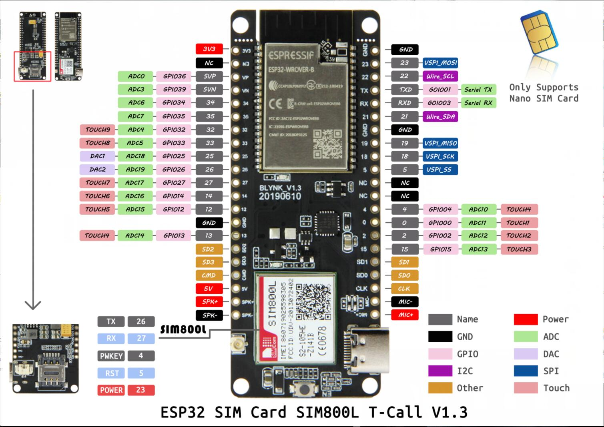

# ESP32 T-CALL

## Pinout
  
  
  
## Examples for SIM800L IP5306 Version

- Loboris Micropython: [/examples/MicroPython_LoBo](../examples/MicroPython_LoBo)
- Arduino + TinyGSM library: [/examples/Arduino_TinyGSM](../examples/Arduino_TinyGSM)
- Arduino OTA update over GSM: [/examples/Arduino_GSM_OTA](../examples/Arduino_GSM_OTA)
- ESP-IDF: https://github.com/espressif/esp-idf/tree/master/examples/protocols/pppos_client
- Platformio Arduino_Thingsboard :[/examples/Platformio_Arduino_Thingsboard](../examples/Platformio_Arduino_Thingsboard)

##  Pin definition
|      Name      | (v1.3)Pins | (v1.4)Pins |
| :------------: | :--------: | :--------: |
|   MODEM  TX    |     26     |     26     |
|   MODEM  RX    |     27     |     27     |
|  MODEM PWRKEY  |     4      |     4      |
|   MODEM RST    |     5      |     5      |
|  MODEM POWER   |     23     |     23     |
|   MODEM DTR    |     ❌      |     32     |
|    MODEM RI    |     ❌      |     33     |
| POWER Chip SDA |     21     |     21     |
| POWER Chip SCL |     22     |     22     |
|      LED       |     ❌      |     13     |
